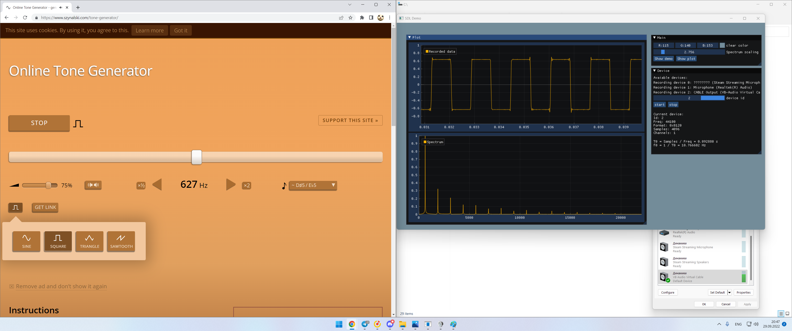
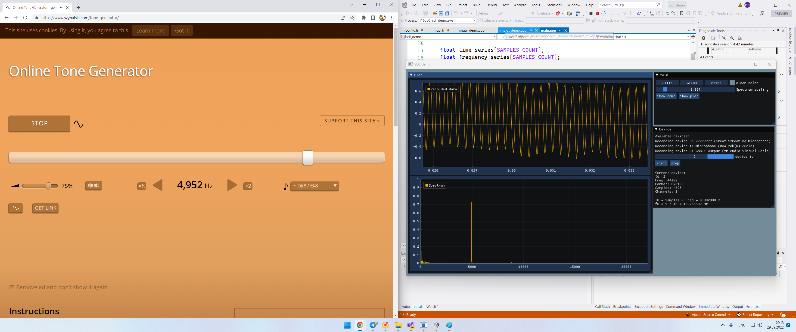
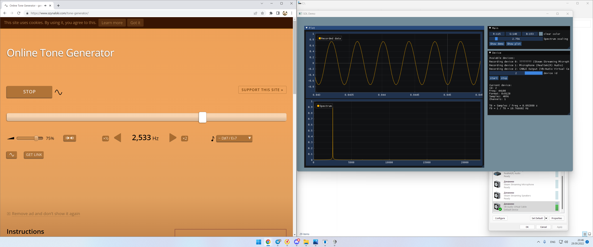
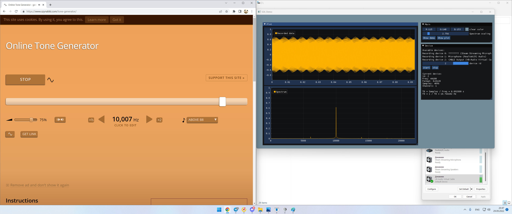

# Быстрое преобразование фурье на SDL2 и ImGui

В 2022 году я ставил себе целью разобраться с imgui и графиками, результат в целом меня устроил.

Можно подавать звук с виртуальных кабелей как делал это я, для этого нужно скачать какой то софт. Можно просто использовать микрофон как источник звука.

На этом скрине есть шум в нижней части спектра потому, что я забыл выключить музыку

