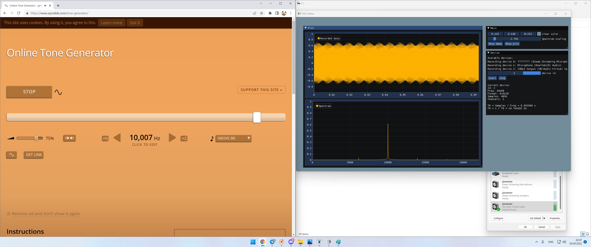

# Быстрое преобразование фурье на SDL2 и ImGui

Можно подавать звук с виртуальных кабелей как делал это я, для этого нужно скачать какой то софт. Можно просто использовать микрофон как источник звука.

Тут я забыл выключить музыку и получился шум в нижней части спектра

